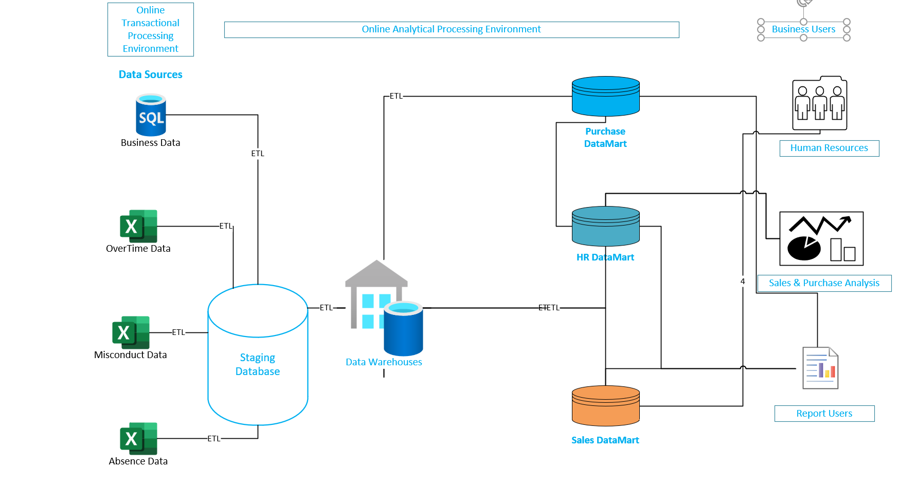
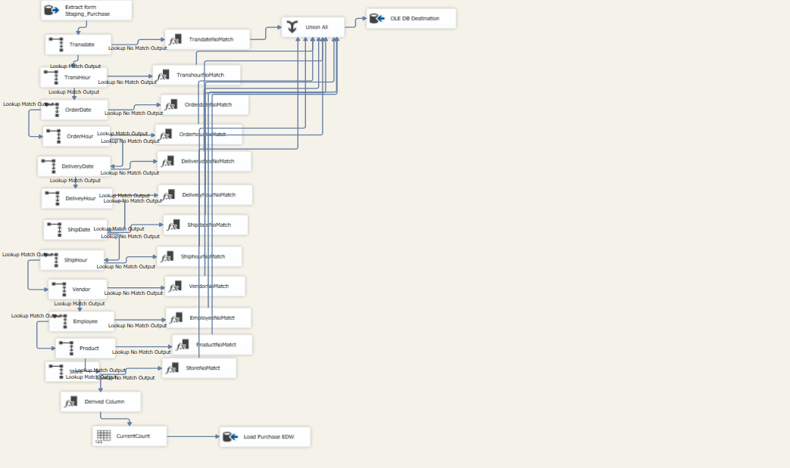
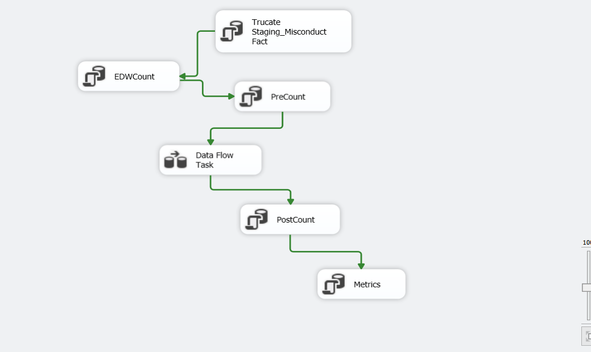
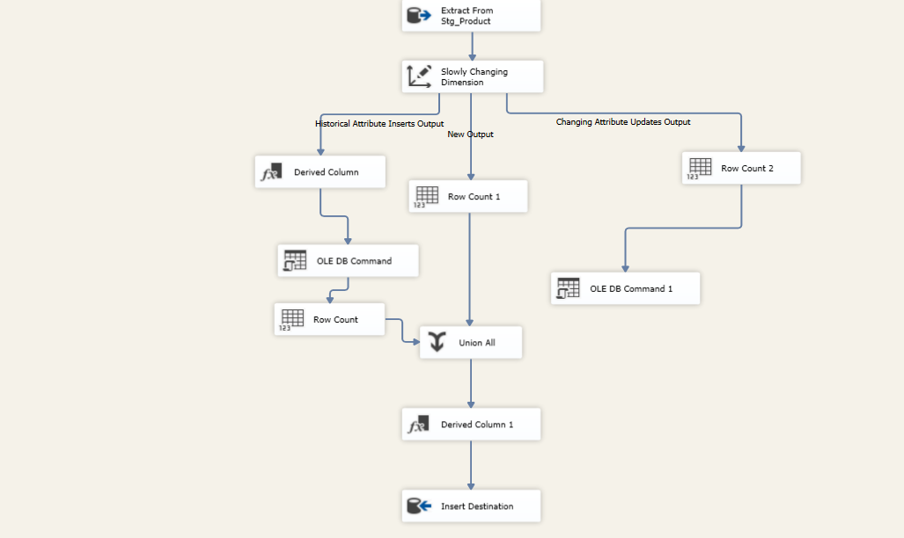
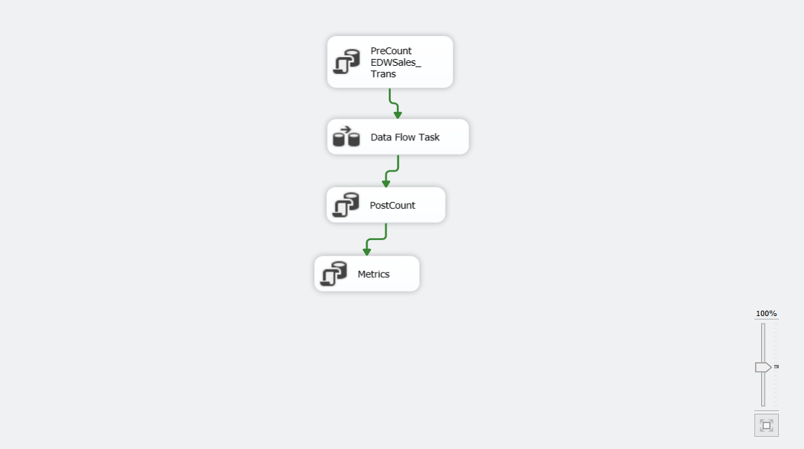
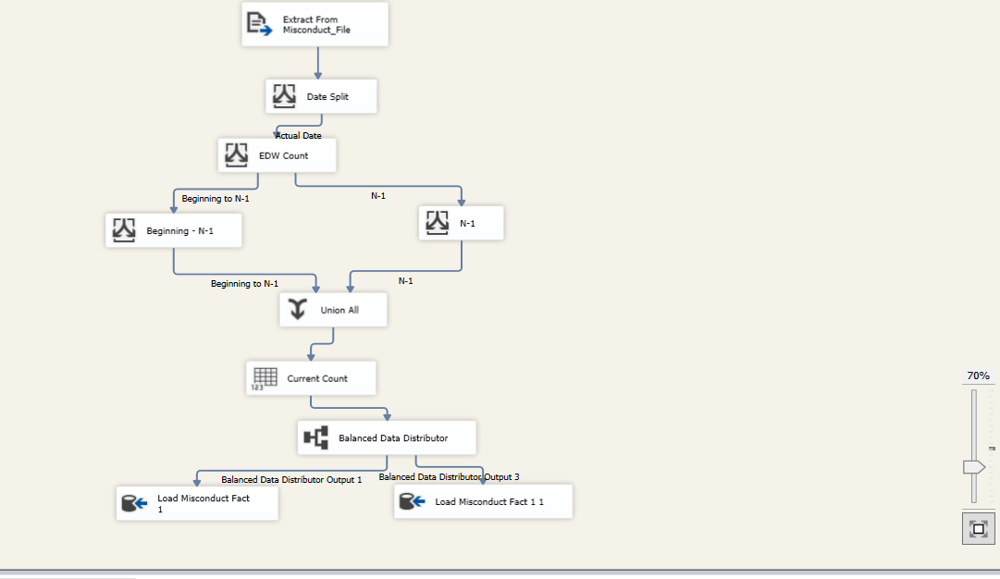
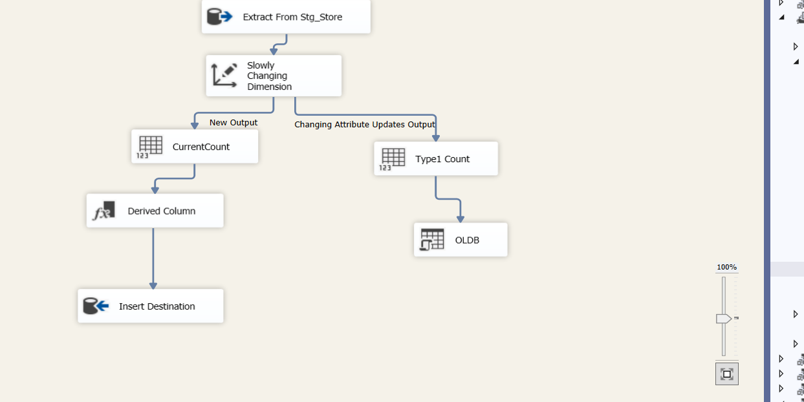
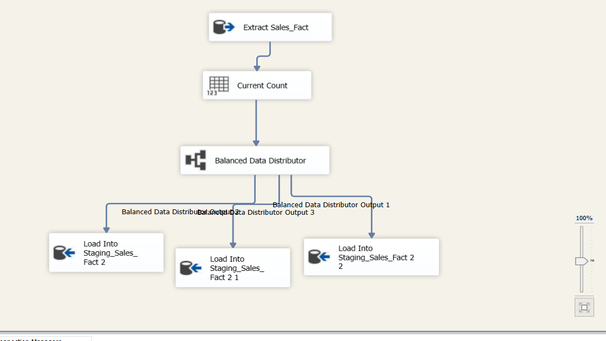
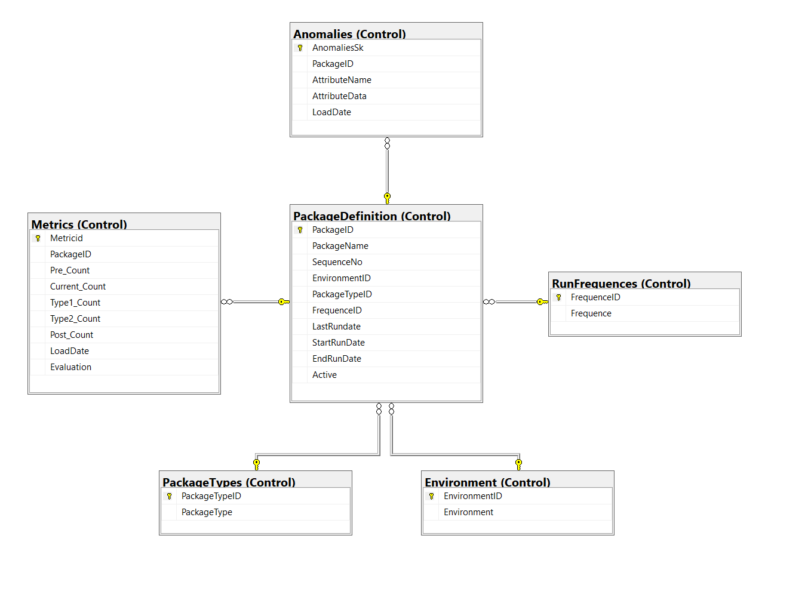
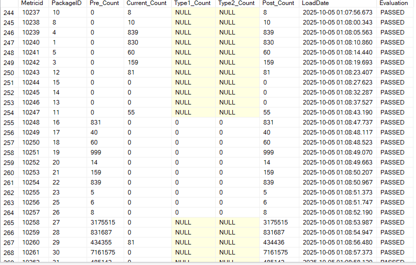

# 📊 Enterprise Data Warehouse Architecture & Modeling (Kimball Methodology)

## 🏗 Introduction
This project demonstrates the end-to-end design and implementation of a **modern Enterprise Data Warehouse (EDW)** solution.  
The goal was to integrate data from multiple disparate systems into a unified analytical platform that provides accurate, consistent, and reliable insights across business units.  

The architecture follows **Ralph Kimball’s dimensional modeling methodology**, enabling scalable data integration, standardized reporting, and a single source of truth for enterprise analytics.

---

## 🧩 Problem Statement
The organization faced challenges with fragmented data across multiple systems — including relational databases, flat files (CSV), and third-party applications.  

This resulted in:
- Inconsistent reporting and duplicated metrics  
- Data quality issues and lack of centralized governance  
- Limited visibility into performance across departments  

To address these challenges, a **centralized data warehouse** was designed and implemented to streamline data flow, improve data quality, and enhance analytical capabilities.

 

  

---

## 🧠 Skills Demonstrated
- **Data Modeling:** Kimball methodology, Star Schema, Dimensional Modeling, conformed dimensions, Role-Playing dimensions  
- **ETL Development:** SSIS, SQL scripting, Source-to-target mapping, data cleansing, transformation, and load automation
- **Automation:** SQL Server Agent job scheduling, incremental loads, error handling
-  **Monitoring & Audit:** Control workload design
-  **Analytics Engineering:** SSAS cube modeling
- **Data Architecture:** Multi-layered architecture (Source Systems → Staging → EDW → Data Marts)  
- **Business Analysis:** Requirement gathering, stakeholder identification, and bus matrix design  
- **Documentation:** Technical & business documentation using industry best practices  
- **Tools & Technologies:**  
  - SQL Server, Excel, Visio,SSIS, SSAS, OData, CSV   
  - Kimball Methodology, ETL scripting, Dimensional Modeling

---

## 🗂 Data Sourcing
Data was ingested from multiple sources including:
- **SQL Server Databases** (transactional systems)  
- **CSV and Excel files** from business users  
- **OData feeds** for external integrations  

Each source was profiled and staged for further transformation and cleansing.

---

## 🔄 Data Transformation (ETL Pipeline)
The ETL process was implemented using **SSIS** and **T-SQL scripts** to perform:
1. **Extraction** from heterogeneous sources  
2. **Transformation** according to business rules:
   - Data validation & standardization  
   - Lookup and surrogate key generation  
   - Slowly Changing Dimensions (Type 1 & Type 2) handling  
3. **Loading** into the EDW and downstream Data Marts

ETL pipelines were **automated using SQL Server Agent** and configured to run during off-peak hours.

🧱 **SQL Scripts:**  
> - [ETL SQL Scripts](Scriptings/BBY_ETL_Scritps.sql)

### 🖼️ ETL Visuals
- **Some ETL Process Flow:**
  
  

  
   
    
     
      
       
             

📁 **Documentation:**
- [Source to Target Mapping - Dimension Tables](Documentations/Documentations/Source_to_Target_Mapping-Dimension.xlsx)  
- [Source to Target Mapping - Fact Tables](Documentations/Documentations/Source_to_Target_Mapping-Fact.xlsx)

---

## 🧮 Data Modeling
The **Enterprise Data Warehouse (EDW)** was designed following the **Kimball approach**, featuring:
- **Fact tables** for business processes 
- **Dimension tables** with conformed and role-playing dimensions  
- **Data Marts** developed for specific business units  

📊 **Supporting Artifacts:**
- [Data Warehouse Model](Visuals/EDW_Model.png)  
- [Bus Matrix](Documentations/Bus_Matrix.xlsx)  
- [Architecture Diagram](Visuals/Architecture.png)

  ## 🧠 Control & Audit Framework
A **Control Framework** was developed to ensure the reliability and traceability of data movements.  
This system monitors ETL success, captures record counts, and isolates anomalies before they enter the EDW.

### Key Components:
- **PreCount, CurrentCount, PostCount:** Track data volumes across ETL stages.  
- **Type1Count / Type2Count:** Monitor changes in Slowly Changing Dimensions.  
- **Anomaly Detection:** Any outliers or unexpected results are diverted to an **Anomalies Table** within the Control Database.  
- **Audit Logging:** Every ETL run is logged for transparency and traceability.  

🧱 **SQL Scripts:**  
> - [Control Workload Scripts](Scriptings/BBY_Control_script.sql)

**Control Schema & Metrics Table**
  

  
       

---

## 👥 Stakeholder & Requirements Management
Key documentation artifacts created to ensure alignment between business and technical teams:
- [Solution Requirements](Documentations/BBY Grocery Store Business Requirements.docx)  
- [Stakeholder Matrix](Documentations/Stakeholder_Matrix.xlsx)

These deliverables helped define scope, identify data owners, and ensure each business unit’s analytical needs were addressed.

---

## ✅ Conclusion
This project successfully delivered a **scalable, maintainable, and business-aligned data warehouse** solution.  
It established a consistent data foundation for reporting and analytics while demonstrating strong data architecture, modeling, and ETL development practices.

The result is a **single version of the truth** for enterprise reporting, enabling faster and more accurate decision-making across departments.

**Business Outcomes:**
- 80% reduction in manual reporting effort  
- Improved data consistency and transparency  
- Automated and auditable ETL processes  
- Centralized analytics for faster insights  
---

